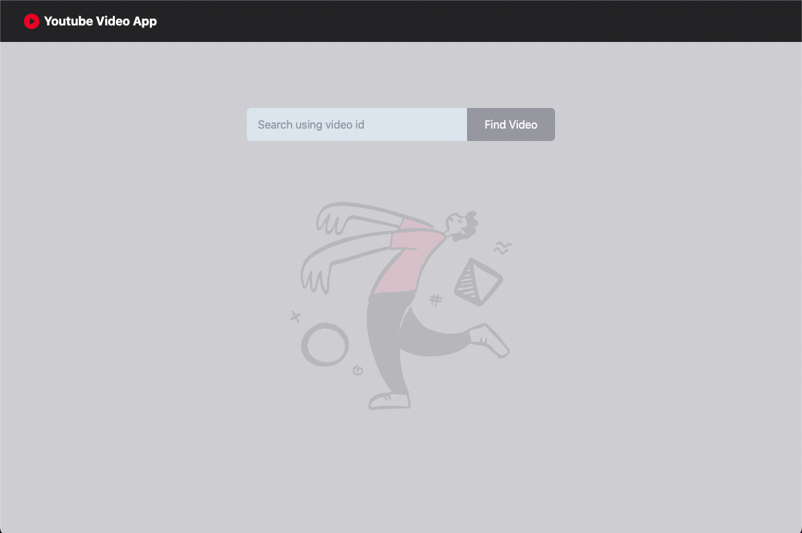

## This project was bootstrapped with <a href="https://github.com/facebook/create-react-app" target="_blank">Create React App</a>.

## Tech/framework used

Built with React.js, tailwindcss, axios.

## Screenshots and demo

## Installation

Clone project git clone https://github.com/slroberts/youtube-video-finder.git

### yarn install

Install dependencies

### yarn start

Runs the app in the development mode.
Open http://localhost:3000 to view it in your browser.

The page will reload when you make changes.
You may also see any lint errors in the console.

## License

[MIT](https://choosealicense.com/licenses/mit/)
Most open source projects use the MIT license. Feel free to choose whichever license you prefer.
